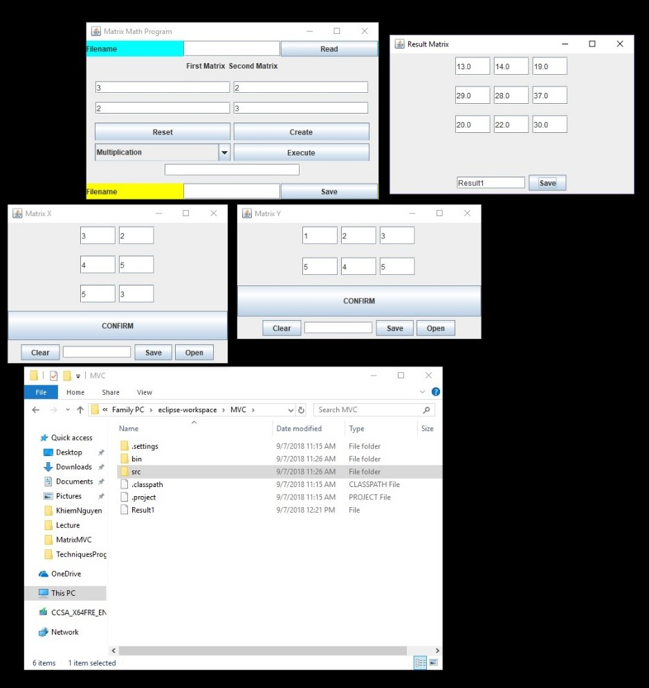
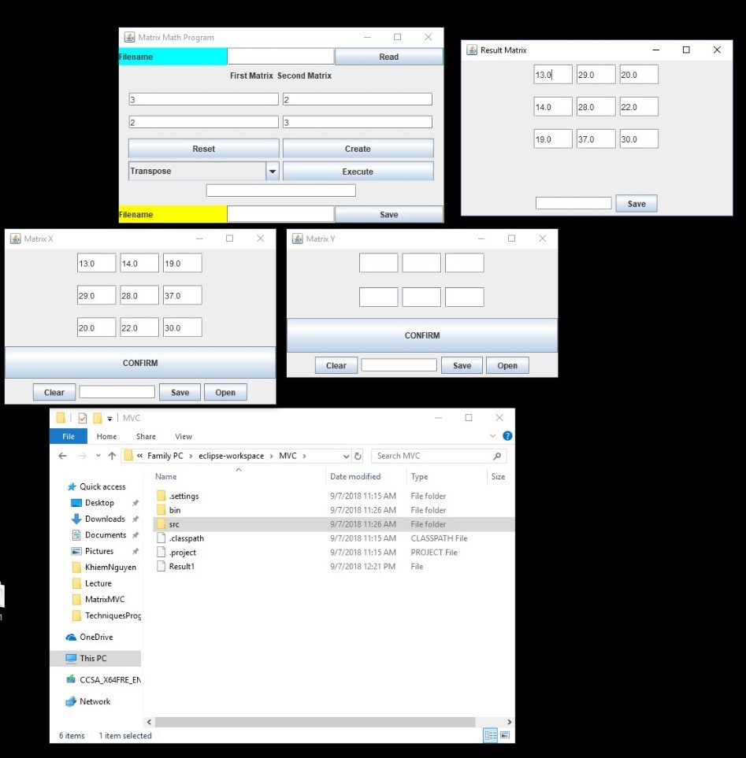

# MatrixOperators
Using the MVC concepts write a set of Java classes to perform matrix operations (such as Addition, Subtraction, Transpose, Multiplication).

### Goal
Using the MVC concepts write a set of Java classes to perform matrix operations (such as Addition,
Subtraction, Transpose, Multiplication).
Program should include a basic GUI interface using swing widgets to select the various options of
your program. Here is a possible example of the GUI, but you can modify it according to your own
design.

### Result

### License
This project is licensed under the MIT License - see the LICENSE.md file for details
